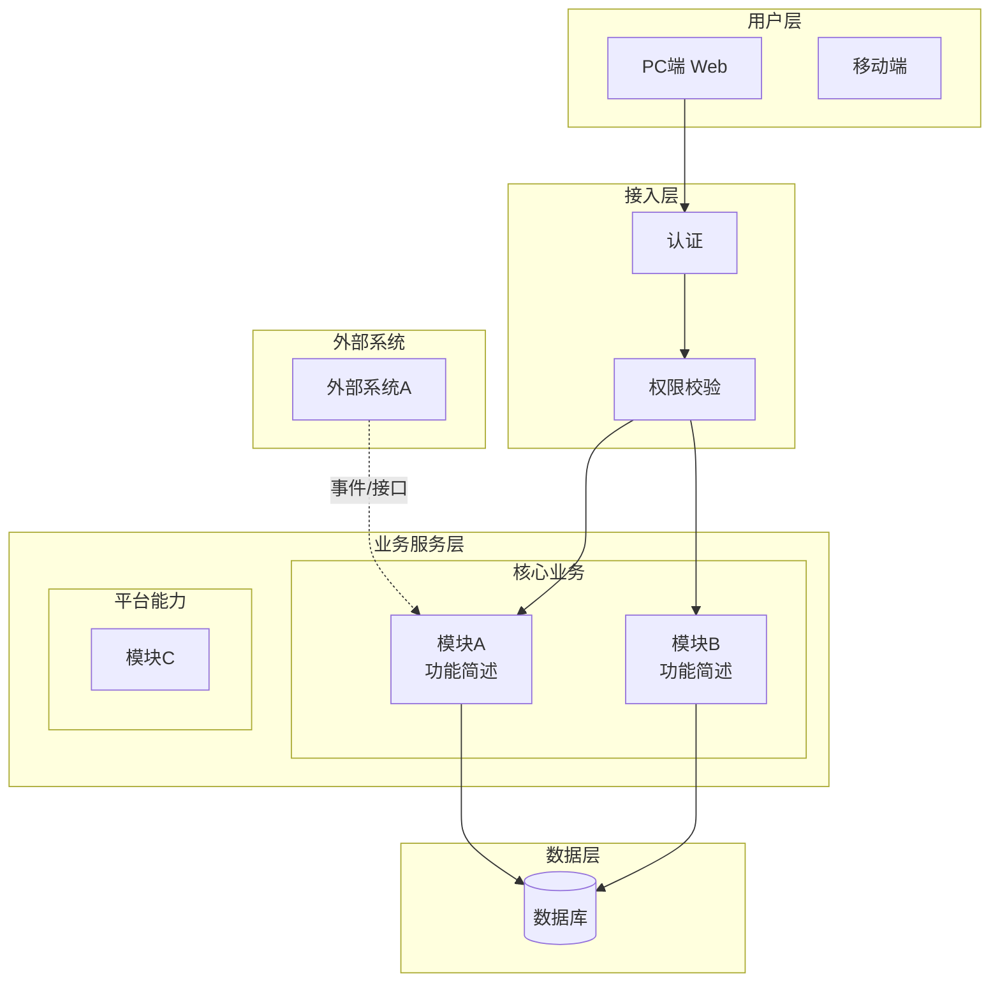
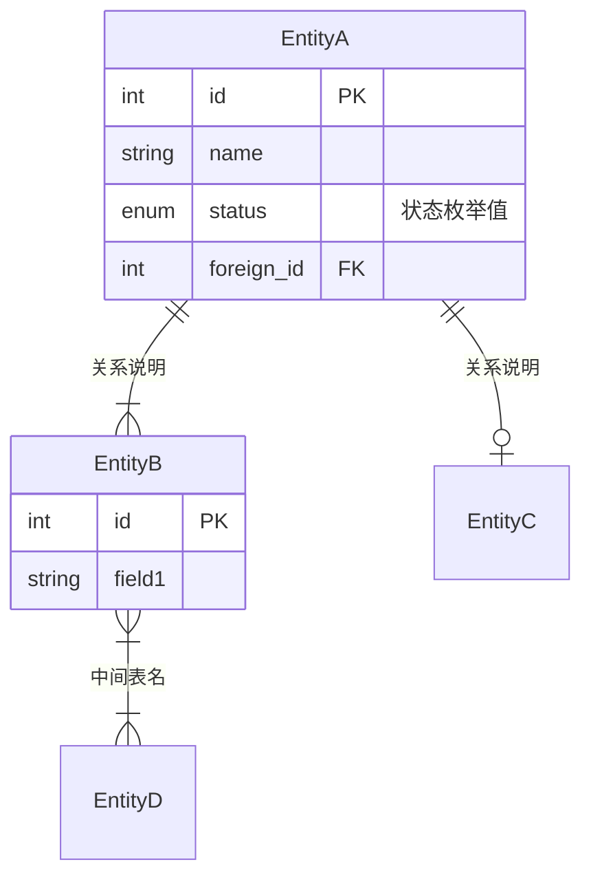
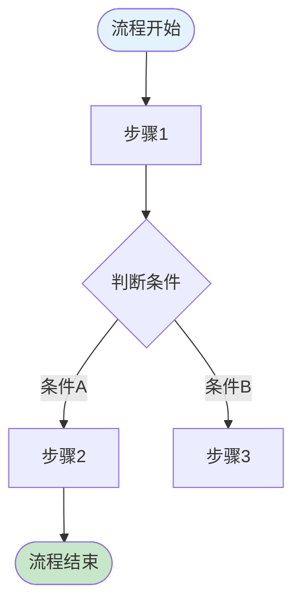
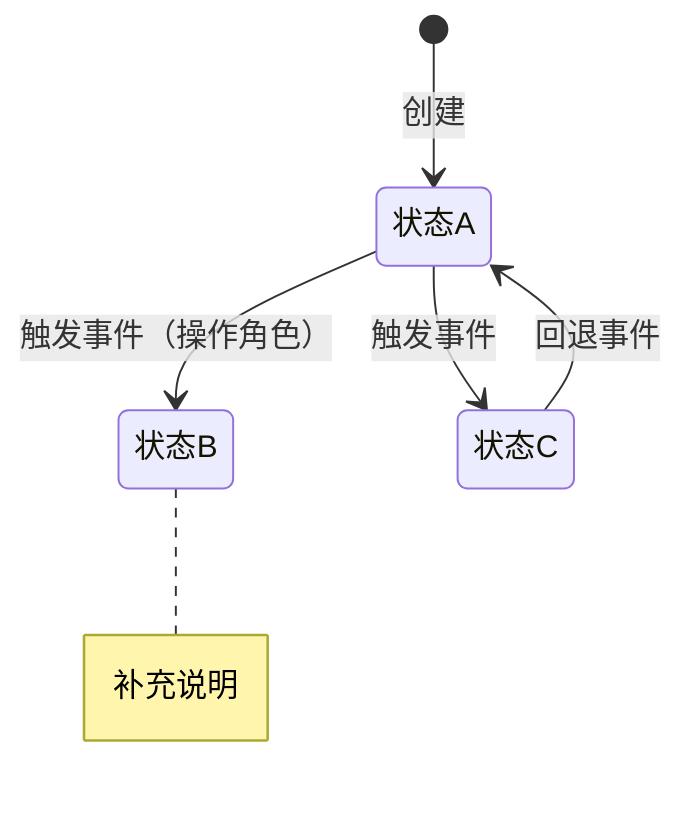

# 第10章 功能需求 — 生成指引

> 生成 PRD 第10章"功能需求"的指引文件。这是 PRD 中最核心、最大的章节。

## 章节目标

以结构化方式详尽描述产品的功能设计，包括产品框架、功能详解和异常处理。

> 💡 方法论基础：
> - 产品框架：《决胜B端》自顶向下设计（框架图→数据模型→流程→页面→权限→字段）
> - 数据建模：《决胜B端》ER建模三步法（找实体→梳关系→定属性）
> - 流程设计：《决胜B端》UML 建模（泳道图 + 状态机）
> - 交互设计：《决胜体验设计》设计价值观 + 四大设计原则（有用、高效、容错、启发）
> - 规则描述：《决胜B端PRD模板》五种规则类型（事实、约束、触发条件、推论、计算）

## 生成结构

### 10.1 产品框架概述

所有图表使用 Mermaid 语法生成。Mermaid 在 GitHub、VS Code、Typora 等环境中可直接渲染。

#### 10.1.1 应用架构图

使用 `graph TD`（自上而下）或 `graph LR`（自左向右），用 `subgraph` 分层。

模板：

````md

````

**生成规则：**
- 分为用户层、接入层、业务服务层、数据层、外部系统 五层
- 业务服务层内部用 `subgraph` 区分核心业务和平台能力
- 外部系统用虚线箭头 `-.->` 表示
- 每个模块节点用 `<br/>` 换行标注功能简述

#### 10.1.2 数据模型图

使用 Mermaid `erDiagram` 语法，同时保留实体说明表格作为补充。

> 💡 ER建模三步法：找到实体 → 梳理关系 → 确定关键属性

模板：

````md

````

**关系符号说明：**
- `||--||` 一对一
- `||--|{` 一对多
- `}|--|{` 多对多（通过中间表）
- `||--o|` 零或一对一

**生成规则：**
- 业务型/交易型产品：ER图必须完整，所有核心实体和关系都要画出
- 每个实体列出关键属性（PK/FK/状态/核心业务字段）
- 关系标注业务含义
- ER图后面附实体说明表格（补充属性细节和业务规则）

#### 10.1.3 核心业务流程图

使用 Mermaid `flowchart` 语法，用不同颜色的节点区分不同角色和关键状态。

模板：

````md

````

**生成规则：**
- 用 `([...])` 表示开始/结束节点（圆角）
- 用 `{...}` 表示判断/分支节点（菱形）
- 用 `[...]` 表示普通步骤
- 用 `[(..)]` 表示数据存储
- 关键状态用 `style` 着色（蓝色=入口、绿色=成功、红色=失败/阻断、橙色=等待）
- 涉及多角色时用 `subgraph` 划分泳道

#### 10.1.4 状态机图

使用 Mermaid `stateDiagram-v2` 语法，同时保留状态转换表格作为补充说明。

模板：

````md

````

**生成规则：**
- 为每个有状态流转的核心实体画一张状态机
- 包含正常路径和异常路径（回退、超时等）
- 用 `note` 标注关键约束
- 状态机图后附状态转换明细表（当前状态→触发事件→目标状态→操作角色→备注）

#### 10.1.5 功能清单

| 子系统 | 页面 | PC端 | H5端 | App端 | 说明 |
| --- | --- | --- | --- | --- | --- |
| {子系统A} | {页面1} | ✓ | — | — | |
| {子系统A} | {页面2} | ✓ | ✓ | — | |

### 10.2 产品需求详解

对每个功能模块，按以下结构生成：

```md
### 10.2 产品需求详解

#### 10.2.1 {模块名称}功能详解

##### 10.2.1.1 业务流程图

{该模块的详细业务流程，用泳道图或步骤列表}

##### 10.2.1.2 页面交互

**{页面名称}**

> 💡 设计原则：有用 > 高效 > 容错 > 启发

页面要素说明：

**查询条件：**

| 字段名称 | 默认值 | 字段类型 | 备注 |
| --- | --- | --- | --- |
| | | 文本/下拉/日期/数字 | |

**列表字段：**

| 字段名称 | 默认值 | 字段类型 | 开放修改 | 必输项 | 备注 |
| --- | --- | --- | --- | --- | --- |
| | | | 是/否 | 是/否 | |

**操作按钮：**

| 按钮名称 | 操作说明 | 触发条件 | 权限要求 |
| --- | --- | --- | --- |
| | | | |

##### 10.2.1.3 业务规则

> 💡 规则五种类型：事实、约束、触发条件、推论、计算

| 编号 | 规则类型 | 规则描述 |
| --- | --- | --- |
| R1 | 约束 | {如：订单金额不可为负数} |
| R2 | 触发条件 | {如：当库存低于安全库存时，自动触发补货提醒} |
| R3 | 计算 | {如：订单总额 = Σ(商品单价 × 数量) - 优惠金额} |
```

### 10.3 异常情况处理方案

```md
### 10.3 异常情况处理方案

| 异常类型 | 异常场景 | 处理方案 |
| --- | --- | --- |
| 网络异常 | 提交操作时断网 | 本地暂存，恢复后自动重试/提示重新提交 |
| 并发冲突 | 多人同时编辑同一记录 | 乐观锁 + 冲突提示，后提交者需刷新确认 |
| 数据异常 | 外部系统返回错误数据 | 校验拦截 + 错误日志 + 人工处理入口 |
| 误操作 | 误删除重要数据 | 软删除 + 回收站 / 操作确认二次弹窗 |
| 业务异常 | 审批超时无人处理 | 超时提醒 → 升级提醒 → 自动转派 |
| {其他} | | |
```

## 生成规则

### 10.1 产品框架

1. **系统框架图**：从第5章的功能模块表展开为层级结构。
2. **数据模型**：
   - 从业务描述中识别核心名词作为实体候选。
   - 用ER三步法：找实体→梳关系→定属性。
   - **业务型/交易型**产品：ER模型必须完整，这是设计的基石。
   - **工具型/基础服务型**：简化数据模型，重点在功能接口。
   - 关系要标注精确的基数（1:1, 1:*, *:*），不能模糊。
   - 考虑未来扩展性：宁可设计为*:*用中间表，也不要后期改模型。
3. **业务流程图**：用文字版泳道图表示核心流程，至少覆盖主流程。
4. **状态机**：为每个有状态流转的核心实体画状态机，包含正常和异常路径。
5. **功能清单**：用表格列出所有页面和多端支持情况。

### 10.2 需求详解

1. **每个模块**都按"流程图→页面交互→业务规则"三段式结构。
2. **页面交互**用表格描述：查询条件表 + 列表字段表 + 操作按钮表。
3. **业务规则**必须按五种类型分类：事实、约束、触发条件、推论、计算。
4. 如果信息充足，生成具体字段和规则；如果不足，生成表格框架并标注 `[TODO]`。

### 10.3 异常处理

1. 至少覆盖：网络异常、并发冲突、数据异常、误操作、业务异常 5类。
2. 每种异常有具体的处理方案，不是"待后续补充"。

### AI 功能设计（如适用）

如果产品包含 AI 功能，在对应模块的需求详解中额外加入：

```md
##### AI 功能设计

> 💡 确定性-容错性四象限分析 + 六脉神剑交互模式选择

**任务特征分析：**

| 分析维度 | 评估 |
| --- | --- |
| 确定性 | 高（目标明确）/ 低（探索性） |
| 容错性 | 高（允许出错）/ 低（必须准确） |
| 推荐交互模式 | {六脉神剑中的具体模式} |

**AI 交互设计：**
- **交互模式**：{封装API / CUI嵌入GUI / Chat / Copilot / 辅助填充 / 后台自动化}
- **人机边界**：{哪些步骤AI执行、哪些需要人确认、哪些必须人操作}
- **降级方案**：{AI 不可用时的回退方案}
- **监控指标**：{准确率、使用率、弃用率等}
```

## 不同产品类型的侧重差异

| 功能类型 | 10.1 侧重 | 10.2 侧重 | 10.3 侧重 |
| --- | --- | --- | --- |
| 业务型 | ER图+流程图+状态机都必须完整 | 每个模块的角色交互和审批流程 | 审批异常、数据一致性 |
| 工具型 | 简化模型，强调使用流程 | 操作效率和快捷方式 | 数据丢失防护、撤销操作 |
| 交易型 | ER图+交易流程图+状态机 | 交易闭环各环节的规则 | 支付异常、库存并发、对账 |
| 基础服务型 | API结构+调用流程 | 接口规范和参数说明 | 服务降级、限流、重试 |

## 质量标准

- [ ] 10.1 至少包含系统框架图和功能清单
- [ ] 10.1 业务型/交易型产品有完整ER模型
- [ ] 10.1 有状态流转的实体都有状态机
- [ ] 10.2 每个模块按"流程→交互→规则"三段式
- [ ] 10.2 页面描述用表格（查询条件+列表字段+操作按钮）
- [ ] 10.2 规则按五种类型分类
- [ ] 10.3 至少覆盖5类异常场景
- [ ] AI功能（如有）使用了四象限+六脉神剑框架
